# DER — Minha Rotina ( diagrama Entidade-Relacionamento)

Derivado do schema real em `src/lib/database.ts` (`createTables`). Não é
desenho de intenção: são as 9 tabelas que o app cria, com os tipos e os
defaults do código.

## Diagrama

```mermaid
erDiagram
    inbox_items {
        INTEGER id PK "AUTOINCREMENT"
        TEXT content "NOT NULL"
        TEXT due_date "nullable"
        TEXT category "nullable"
        DATETIME created_at "DEFAULT CURRENT_TIMESTAMP (UTC)"
    }

    hoje_items {
        INTEGER id PK "AUTOINCREMENT"
        INTEGER inbox_id "NOT NULL - sem FK, ver nota 1"
        TEXT content "NOT NULL DEFAULT ''"
        TEXT due_date "nullable"
        TEXT category "nullable"
        DATETIME created_at "DEFAULT CURRENT_TIMESTAMP (UTC)"
        INTEGER checked "DEFAULT 0"
    }

    saida_items {
        INTEGER id PK "AUTOINCREMENT"
        TEXT content "NOT NULL"
        INTEGER position "NOT NULL DEFAULT 0"
        INTEGER checked "DEFAULT 0"
        DATETIME checked_at "nullable"
    }

    saida_log {
        INTEGER id PK "AUTOINCREMENT"
        DATETIME saiu_at "DEFAULT CURRENT_TIMESTAMP (UTC)"
    }

    events {
        INTEGER id PK "AUTOINCREMENT"
        TEXT type "NOT NULL"
        DATETIME created_at "DEFAULT CURRENT_TIMESTAMP (UTC)"
    }

    ajustes_semanais {
        INTEGER id PK "AUTOINCREMENT"
        TEXT texto "NOT NULL"
        DATETIME created_at "DEFAULT CURRENT_TIMESTAMP (UTC)"
    }

    timer_state {
        TEXT prefix PK
        TEXT day "NOT NULL - dia local, YYYY-MM-DD"
        INTEGER elapsed_ms "NOT NULL DEFAULT 0"
        INTEGER running "NOT NULL DEFAULT 0"
        INTEGER started_at "nullable - epoch ms"
    }

    users {
        INTEGER id PK "AUTOINCREMENT"
        TEXT name "NOT NULL"
        TEXT email "nullable - UNIQUE na aplicação"
        TEXT salt "nullable"
        TEXT password_hash "nullable"
        DATETIME created_at "DEFAULT CURRENT_TIMESTAMP (UTC)"
    }

    meta {
        TEXT key PK
        TEXT value "nullable"
    }
```

**Não há linha ligando as entidades**, e isso é proposital, não esquecimento —
ver a nota 1.

## Notas de projeto

**1. `hoje_items.inbox_id` não tem chave estrangeira, e não deveria.**
Promover um item ao dia copia `content`, `due_date` e `category` para
`hoje_items` e **apaga a linha de origem** em `inbox_items`. A referência fica
órfã no mesmo instante. Com `ON DELETE CASCADE`, a promoção apagaria também a
prioridade recém-criada. Por isso o conteúdo é **desnormalizado** em
`hoje_items`: a cópia é o vínculo. A versão anterior não tinha essa coluna e
fazia `JOIN` — o item sumia das duas telas ao ser promovido. Defeito corrigido,
com caso de teste.

**2. Nenhuma tabela declara `FOREIGN KEY`.** As relações do app são 1..1 por
convenção da aplicação, não impostas pelo SQLite. A vantagem é que a migração
nunca quebra por linha órfã; o custo é que o banco não protege a integridade
sozinho.

**3. `CURRENT_TIMESTAMP` grava UTC; "hoje" é dia local.** Os limites do dia não
usam `date('now')` nem `date(col,'localtime')` — este último devolveria UTC de
novo no SQLite do navegador. O app calcula os limites em TypeScript
(`utcDayStart`) e envia como parâmetro, e compara as duas pontas em UTC.
`timer_state.day` guarda o dia **local** em `YYYY-MM-DD`, porque o ciclo do
Pomodoro pertence ao dia da pessoa.

**4. `meta` é chave/valor genérica.** Guarda a sessão (`activeUserId`), o
horário do lembrete de saída (`alarme.hora`) e a duração do bloco
(`timer.duracaoMin`). Não ganhou coluna própria porque não há consulta que
precise de tipagem ou índice sobre esses valores.

**5. `timer_state` é a única com PK não numérica.** `prefix` separa cronômetros
independentes (hoje existe `pomodoro`) sem precisar de coluna de dono.

## Mapa entidade → tela

| Tabela | Tela | Operações |
|---|---|---|
| `inbox_items` | Hoje (zona Inbox) | captura, edição, exclusão, promoção |
| `hoje_items` | Hoje (zona Prioridades) | listagem do dia, concluir, remover |
| `saida_items` | Saída | checklist, concluir, editar |
| `saida_log` | Revisão | registro de horário de saída |
| `events` | Revisão | contagem de dias com inbox zerado |
| `ajustes_semanais` | Revisão | ajuste escrito da semana |
| `timer_state` | Timer | persistir o bloco em andamento |
| `users` | login | cadastro e verificação de senha |
| `meta` | várias | sessão, lembrete, duração do bloco |

## Migrations

Colunas adicionadas depois da criação inicial, por `ensureColumn` (verificação
de existência antes do `ALTER TABLE`), para que abrir uma versão antiga do
banco nunca quebre por campo faltando:

| Tabela | Coluna | Tipo |
|---|---|---|
| `inbox_items` | `due_date` | `TEXT` |
| `inbox_items` | `category` | `TEXT` |
| `hoje_items` | `content` | `TEXT NOT NULL DEFAULT ''` |
| `hoje_items` | `due_date` | `TEXT` |
| `hoje_items` | `category` | `TEXT` |
| `users` | `email` | `TEXT` |
| `users` | `salt` | `TEXT` |
| `users` | `password_hash` | `TEXT` |